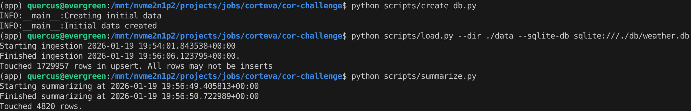
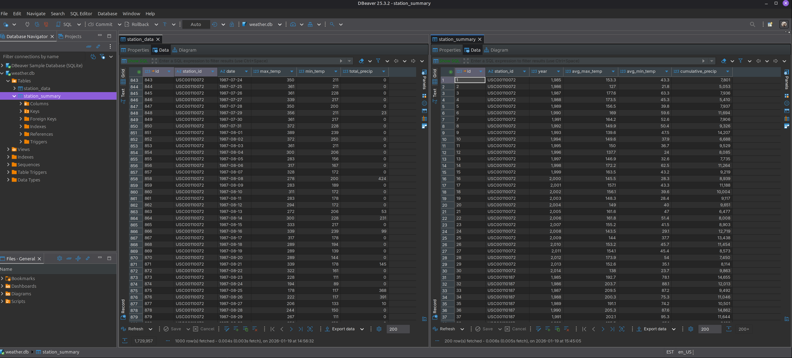
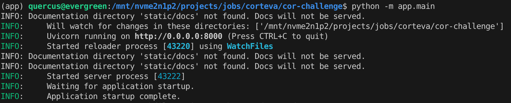
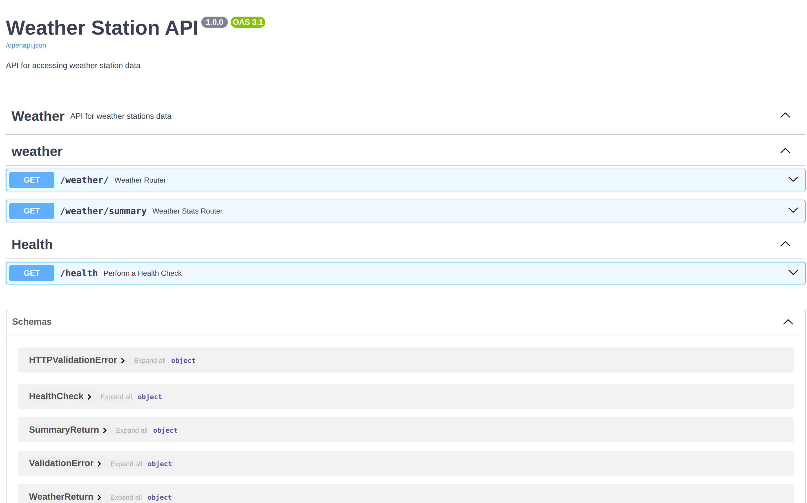
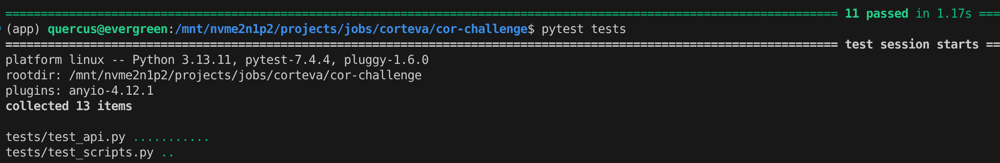

# cor-challenge

This repository contains a pipeline to load weather station data from text files to a SQLite database. The data is summarized annually per station. A FastAPI application serves two routes:

- `/weather`: Station data queriable by station and/or date
- `/weather/summary`: Annual station summary data queriable by station and/or year

The repository is structured such that:
- Application code: `app`
- Ingestion code: `scripts`
- Source data: `data`
- Test suite: `tests`
- Database (will be created): `db`

Follow the steps below to run the code.

Development is managed with `pre-commit` and `ruff`.

## Getting Started
This repo is managed through [UV](https://docs.astral.sh/uv/getting-started/installation/) and can be installed through:
```sh
uv sync
source .venv/bin/activate
```

uv is a lightweight, very fast package manager based on rust. Installing this repo with other managers may have unexpected outcomes, particularly when running `scripts` that read from the `app` package.

This repo has only been run in a linux environment.

## Setting up the database
To create database:

```sh
python scripts/create_db.py
```
This creates an empty SQLite database based on the `sqlalchemy` models in `app/models.py`

To load database with data:

```sh
python scripts/load.py --dir ./data --sqlite-db sqlite:///./db/weather.db
```
This parses all weather station text files in the `./data` directory and upserts to `station_data` table using `pandas` and `sqlalchemy`. If it is run multiple times, the upsert will check for constraint `(station_id, date)`. If the data for a given `(station_id, date)` has changed, it will be updated. Duplicates will not be created.

To create annual station summaries:

```sh
python scripts/summarize.py
```
This will summarize the `station_data` into `station_summary` using `sqlalchemy`. If it is run multiple times, the upsert will check for constraint `(station_id, year)`. If the data for a given `(station_id, year)` has changed, it will be updated. Duplicates will not be created.



The database is now setup. You can view this in your preferred database viewer (e.g. DBeaver)




## Running the API
To run the API:

```sh
python -m app.main
```

This will spin up the FastAPI client.

View the Swagger docs at: `http://localhost:8000/docs`. Here, you can see, read documentation, and test all endpoints. Each endpoint has multiple example options under "Try it" or you can modify these yourself.

Redoc is also available at: `http://localhost:8000/redoc`

Spinning up API:


Swagger docs:


Swagger docs - route:


## Running tests
This repo includes a `pytest` suite. It creates a mock database called `test.db` to use with the mock client. The DB is flushed after each run. Temporary data files are written to `tests/data` for each test and removed on compeletion. All tests should pass.

```sh
pytest tests
```



## Notes
This was a developed as a demo case. Here are some modifications I would make if continuing development or deploying to prod.

Changes / if in production:
- Use PostgreSQL. SQLite was used for development ease
- Use Postgres materialized view for summary statistics
- Use migration scripts (e.g. liquibase, alembic) for database creation (generated from SQLAlchemy for convenience in demo)
- Use primary key based on station id - date combination (removes need for using constraint on duplicate columns)
- Create index on station id and date in both tables
- `year` in summary should be `date` type
- Allow filtering in API by multiple stations or dates
